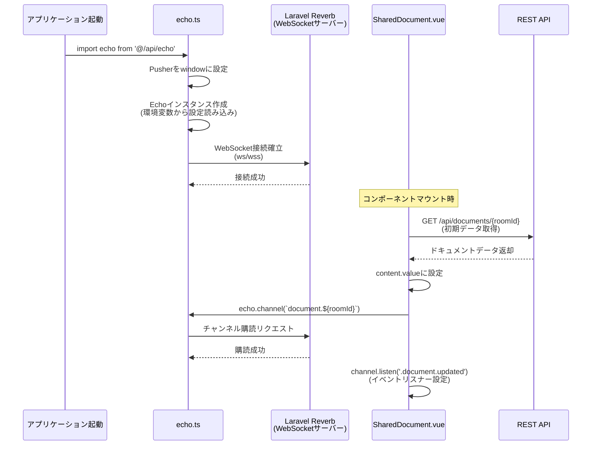
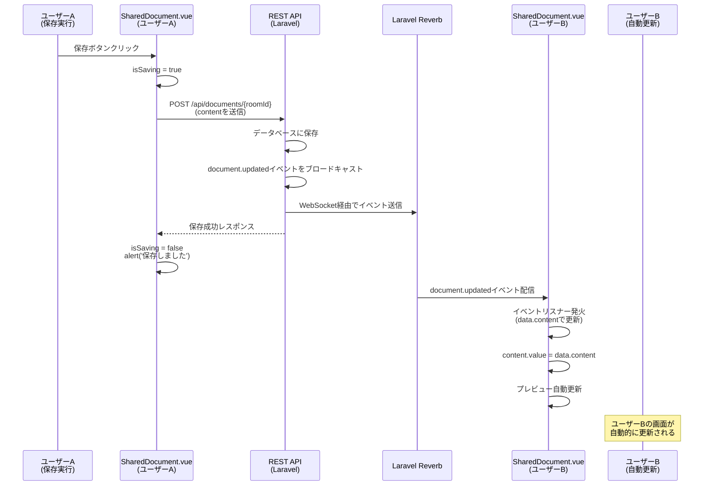

# laravel-rds-vue

## personal_memo

### fetch → fetchWithAuth

- API
src\lib\fetchWithAuth.ts
src\api\auth.ts

- VIEW

vue-routerをインストール
tsconfig.jsonに追記
```json
    "moduleResolution": "node",
```
編集したらTS サーバーを再起動
src\views\Login.vue
router/index.ts

This template should help get you started developing with Vue 3 in Vite.

### 環境変数の設定

#### VITE_ プレフィックス

環境変数を クライアント側（ブラウザ） に公開する際、VITE_ で始まる変数 のみ を公開します。

#### Vite の環境変数の仕組み

- npm run dev → .env を使用
- npm run build → .env.production を使用

#### 環境変数の型定義

src/vite-env.d.ts
.d.ts = Declaration File（宣言ファイル） の略


### CI/CD GitHub Actions

Lightsail で新しい SSH キーを作成
Lightsail のブラウザターミナルで以下を実行、確認
```bash
ubuntu@ip-172-26-6-105:~$ ssh-keygen -t rsa -b 4096 -C "github-actions" -f ~/.ssh/github_actions_key -N ""
ubuntu@ip-172-26-6-105:~$ cat ~/.ssh/github_actions_key
```
信頼する公開鍵のリストに追加

```bash
cat ~/.ssh/github_actions_key.pub >> ~/.ssh/authorized_keys
```

GitHub で Vue リポジトリを開く
Settings → Secrets and variables → Actions
「New repository secret」をクリック
以下を入力

Name: SSH_PRIVATE_KEY
Secret: コピーした秘密鍵を貼り付け
「Add secret」をクリック

同様に

| Name | Value |
|------|-------|
| SSH_HOST | 54.178.81.51 |
| SSH_USER | ubuntu |

.github\workflows\deploy.ymlを作成

mainでpush

#### Nginx の設定
Lightsail で Vue アプリ用の Nginx 設定を作成します。

Lightsailのターミナルで下記
```bash
sudo nano /etc/nginx/sites-available/vue
```
下記を張り付け
```
server {
    listen 8080;
    server_name 54.178.81.51;
    
    root /var/www/vue;
    index index.html;
    
    location / {
        try_files $uri $uri/ /index.html;
    }
}
```
##### 設定を有効化して Nginx を再起動

```bash
# シンボリックリンクを作成
sudo ln -s /etc/nginx/sites-available/vue /etc/nginx/sites-enabled/

# 設定をテスト
sudo nginx -t

# Nginx を再起動
sudo systemctl reload nginx
```

##### ファイアウォールでポート 8080 を開放

AWS Lightsail のコンソールで:

インスタンスの「ネットワーキング」タブ
「ルールを追加」
アプリケーション: カスタム
プロトコル: TCP
ポート: 8080
保存

## Recommended IDE Setup

[VS Code](https://code.visualstudio.com/) + [Vue (Official)](https://marketplace.visualstudio.com/items?itemName=Vue.volar) (and disable Vetur).

## Recommended Browser Setup

- Chromium-based browsers (Chrome, Edge, Brave, etc.):
  - [Vue.js devtools](https://chromewebstore.google.com/detail/vuejs-devtools/nhdogjmejiglipccpnnnanhbledajbpd) 
  - [Turn on Custom Object Formatter in Chrome DevTools](http://bit.ly/object-formatters)
- Firefox:
  - [Vue.js devtools](https://addons.mozilla.org/en-US/firefox/addon/vue-js-devtools/)
  - [Turn on Custom Object Formatter in Firefox DevTools](https://fxdx.dev/firefox-devtools-custom-object-formatters/)

## Customize configuration

See [Vite Configuration Reference](https://vite.dev/config/).

## Project Setup

```sh
npm install
```

### Compile and Hot-Reload for Development

```sh
npm run dev
```

### Compile and Minify for Production

```sh
npm run build
```

## WebSocket処理フロー

このプロジェクトでは、Laravel EchoとLaravel Reverbを使用してリアルタイム通信を実現しています。主に共同編集機能（`SharedDocument.vue`）で使用されています。

### 関連ファイル

- `src/api/echo.ts`: Laravel Echoインスタンスの初期化と設定
- `src/api/sharedDocument.ts`: REST API経由でのドキュメント操作
- `src/views/SharedDocument.vue`: 共同編集エディタコンポーネント

### 初期化と接続フロー



### 保存とリアルタイム同期フロー



### コンポーネントライフサイクル

```mermaid
flowchart TD
    A[アプリケーション起動] --> B[echo.ts: Echoインスタンス初期化]
    B --> C[Laravel Reverbに接続]
    
    D[SharedDocument.vue マウント] --> E[REST APIで初期データ取得]
    E --> F[WebSocketチャンネルに接続<br/>document.{roomId}]
    F --> G[イベントリスナー設定<br/>.document.updated]
    
    H[ユーザーが編集] --> I{保存ボタンクリック?}
    I -->|Yes| J[REST APIで保存]
    J --> K[サーバーがWebSocketで<br/>他のユーザーに通知]
    K --> L[他のユーザーの画面が<br/>自動更新]
    I -->|No| H
    
    M[コンポーネントアンマウント] --> N[echo.leaveでチャンネル切断]
    N --> O[WebSocket接続終了]
    
    style B fill:#e1f5ff
    style F fill:#fff4e1
    style J fill:#e8f5e9
    style K fill:#fce4ec
```

### 技術スタック

- **Laravel Echo**: Laravel公式のリアルタイム通信ライブラリ
- **Laravel Reverb**: Laravel公式のWebSocketサーバー（Pusherプロトコル互換）
- **Pusher.js**: WebSocket接続の基盤ライブラリ

### 環境変数

WebSocket接続に必要な環境変数（`.env`ファイルに設定）：

```env
VITE_REVERB_APP_KEY=your-app-key
VITE_REVERB_HOST=your-reverb-host
VITE_REVERB_PORT=8080
VITE_REVERB_SCHEME=https
```

